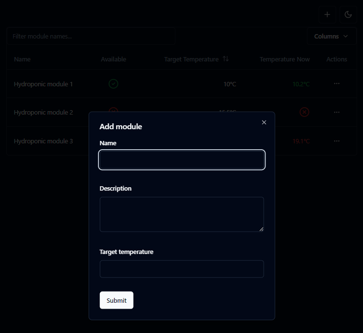
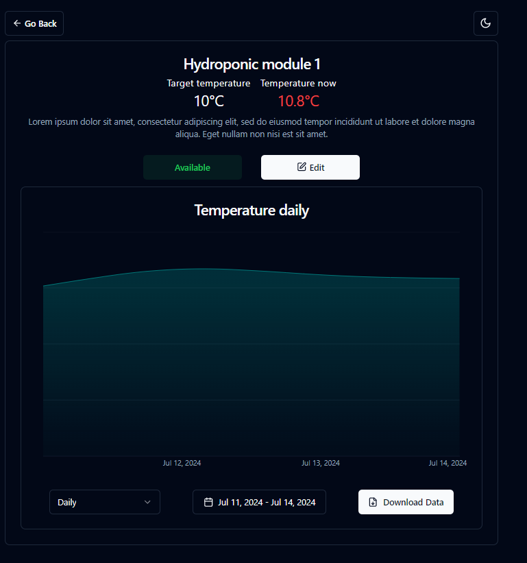

# Zadanie rekrutacyjne: aplikacja do zarządzania modułami IoT

Ta aplikacja frontend do [zadania rekrutacyjnego](https://gitlab.com/piotrdurniat/recruitment-luna)

## Stack


## Instalacja

```bash
git clone https://github.com/redkorr/luna-frontend-task.git
cd luna-frontend-task
npm ci
# Podczas gdy backend jest uruchomiony
npm run dev
```

Aplikacja powinna uruchomić się pod adresem: `http://localhost:5173`

## Testy

```bash
npm run test
```

## Endpointy

`/` => Strona listy modułów

`/:id` => Strona szczegołów modułów

## Zaimplementowane funkcje

- Strona listy modułów
- Strona szczegółów modułu
- Wyświetlanie aktualnej wartości temperatury
- Wyświetlanie danych historycznych temperatury
- Możliwość zmiany motywu ciemny/jasny
- Możliwość skopiowania id modułu
- Pobieranie danych historycznych modułu w plikach `.csv`
- Obsługa błędów i pustych stanów
- Możliwość ukrywania kolumn w liście modułów
- Filtrowanie listy modułów po nazwie
- Dodawanie modułów z poziomu listy
- Inny layout dla mobilnej listy modułów

## Potencjalne usprawnienia

- Dodanie state managera by uniknąć `prop drilling`

## Widoki aplikacji

### Desktop







### Mobile


